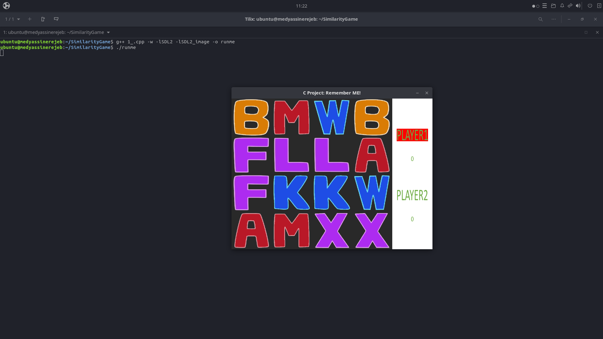
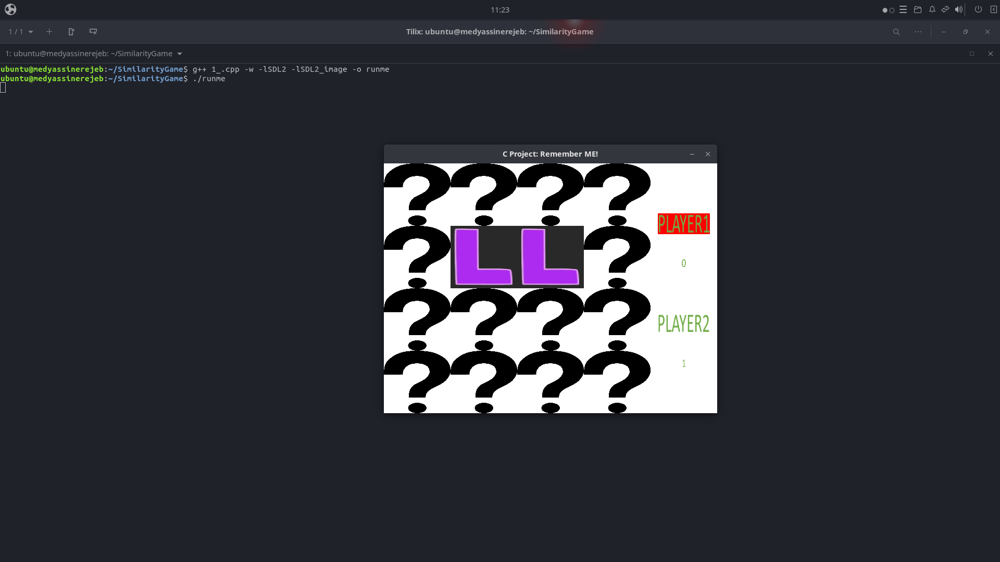

# Context of the project
This project was made in the context of a graded assignement in the module "C pragramming" in the first year of university.

# Project Name

SimilarityGame

## Overview

## Installation

**PS:** This project was tested on an ubuntu distro.

1. Install the SDL2 C Library
`# apt-get install libsdl2-dev`
2. Install the extended library for image management
`# apt-get install libsdl2-image-dev` 
## Usage

1. Clone the repo : `$ git clone https://github.com/Yassine-Rejeb/SimilarityGame.git`

2. cd into the directory and Compile the code : `$ g++ 1_.cpp -w -lSDL2 -lSDL2_image -o runme`

3. Add permissions and execute: `$ chmod u+x runme & ./runme`
## Credits

All credits goes to [Lazy Foo](https://lazyfoo.net)

## License

GPLv3

